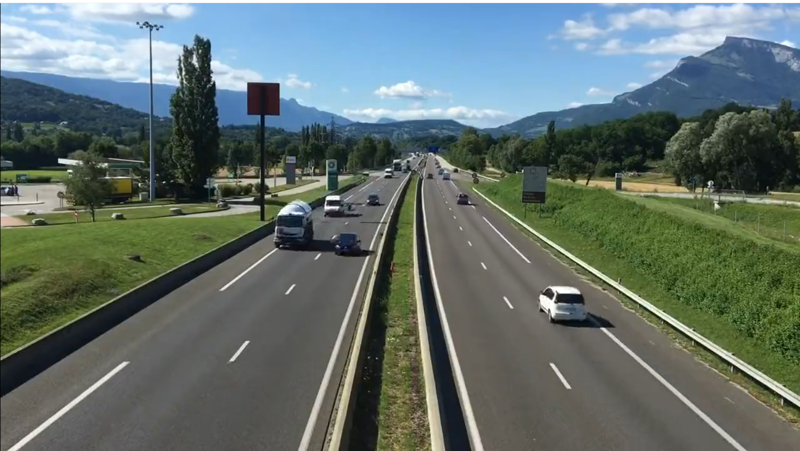
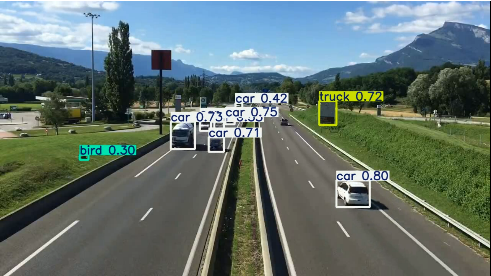

# Car Detection in Driving Videos using YOLOv5

This project uses the YOLOv5 object detection model to detect **cars** in real-time from driving videos. The input is a video file, and the output is a video with bounding boxes drawn around detected cars.

---

## Model

- **YOLOv5**: You Only Look Once (v5), a state-of-the-art real-time object detection model.
- Pre-trained on the **COCO dataset**.

---

## Input Video frame: 

## Output Video frame: 

